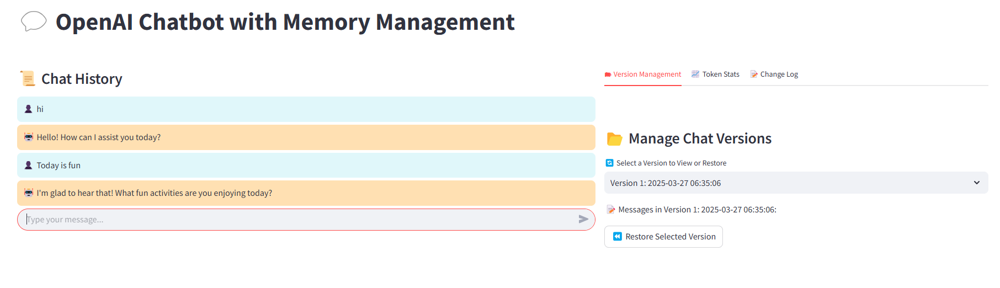
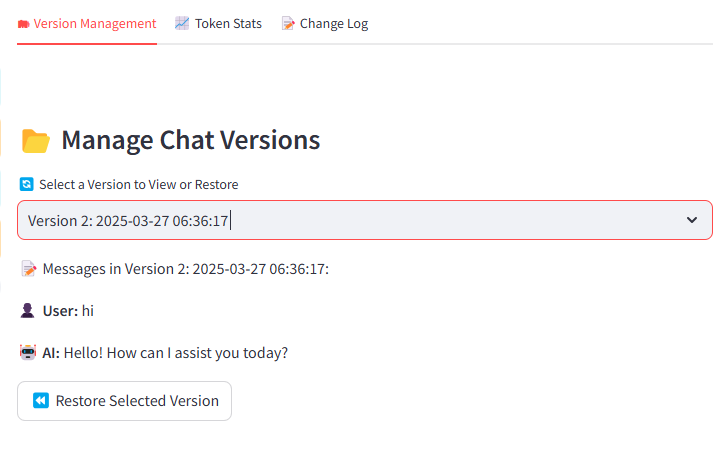
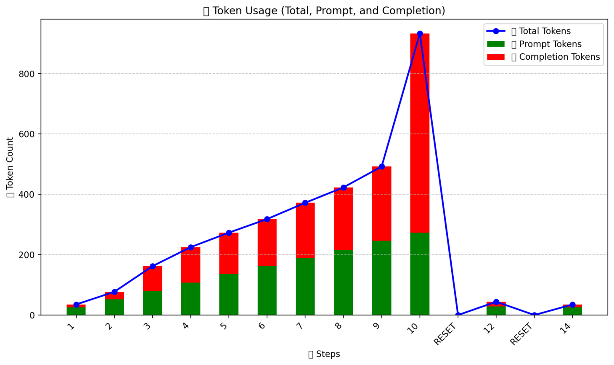
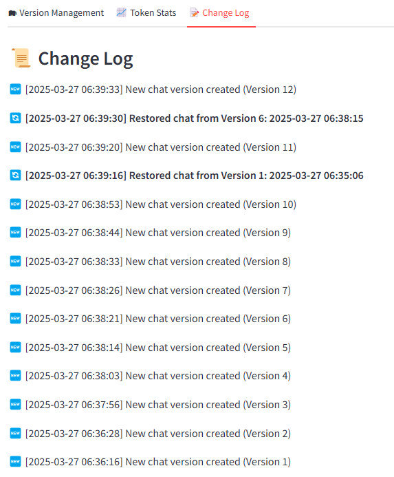

## 🚀 Chatbot Project

### **🔹 Introduction**

This **Chatbot App** allows users to engage in dynamic conversations with the chatbot while offering robust features for managing the chat sessions. Key features of the app include:

- **Chat Versioning**: Track the version of the chat from input to input, enabling users to see each version as the conversation progresses.
- **Token Management**: Monitor token usage to ensure efficient resource management during conversations with the OpenAI API.
- **Restore Previous Versions**: Restore a previous chat version to maintain context or handle token management effectively.
- **Change Log**: View a log of changes made in the chat, including version updates and restoration actions, for transparency and better tracking of chat history.

--- 

### **🔹 Visuals**

Here are some helpful visuals to understand how the app functions and its key features:

#### **1. Chat Interface**

The **chat interface** shows the user’s conversation with the chatbot. The app allows easy interaction and gives clear outputs based on user input.



#### **2. Version Log**

The **version log** shows how different versions of the chat are tracked, restored, and created during interactions. This log also helps users see the timeline of version updates.



#### **3. Token Plot**

The **token plot** displays the token usage over time to help you monitor usage and ensure efficient interaction with the OpenAI API. It helps prevent running out of tokens or exceeding limits.



#### **4. Change Log**

The **change log** records major updates, including the creation of new versions and restoration of previous ones, allowing for easy tracking of the chatbot's evolution.




---

### **🔹 How the Code is Structured**

The project is divided into two main sections for better separation of concerns:

1. **`chatbot_v2.py`**: This file contains the **core logic** of the chatbot, handling the interactions, token usage, version management, and restoration of chat history.
   
2. **`chatbot_ui_v2.py`**: This file is responsible for the **Streamlit interface**, which provides a user-friendly way to interact with the chatbot, track versions, and view logs.

---

### **🔹 How to Clone and Run This Project on GitHub Codespaces**

Easily clone and run this project in **GitHub Codespaces** by following the steps below:

---

### **1️⃣ Clone the Repository**

To get started, you need to clone the repository to your local machine or GitHub Codespaces:

```bash
git clone https://github.com/your-username/your-repo-name.git
cd your-repo-name
```

Alternatively, if you're using **GitHub Codespaces**, you can skip cloning and proceed directly to step **2️⃣**.

---

### **2️⃣ Open in GitHub Codespaces**

1. **Go to the GitHub repository** in your browser.
2. Click on the **"Code"** button.
3. Select **"Open with Codespaces"** → If you don’t see this option, click **"New Codespace"**.
4. This will launch a development environment in your browser.

---

### **3️⃣ Set Up GitHub Codespaces Secrets**

To securely store your API keys and other sensitive data, you need to configure **GitHub Codespaces secrets**.

1. In your GitHub repository, go to the **"Settings"** tab.
2. On the left sidebar, scroll down to the **"Secrets and variables"** section and click on **"Codespaces"**.
3. Click **"New repository secret"** to add a secret.
4. Add the following secret:
   - `OPENAI_API_KEY`: Your OpenAI API key.

Once added, your secret will automatically be available in your Codespaces environment.

---

### **4️⃣ Activate the Virtual Environment**

If the virtual environment (`venv`) already exists, activate it:

```bash
source venv/bin/activate  # For Mac/Linux
venv\Scripts\activate     # For Windows (Git Bash or PowerShell)
```

> ⚠️ **If no virtual environment exists, you need to create one:**

```bash
python3 -m venv venv   # For Mac/Linux
python -m venv venv    # For Windows
source venv/bin/activate  # Activate it
```

---

### **5️⃣ Install Dependencies**

Make sure all required Python packages are installed:

```bash
pip install -r requirements.txt
```

---

### **6️⃣ Configure Your OpenAI API Key**

1. **For GitHub Codespaces**: Your OpenAI API key is automatically available through the **GitHub Codespaces secrets** as `OPENAI_API_KEY`.

2. **For Local Development**: You need to create a `.env` file in the root of your repository to store your OpenAI API key securely.

   1. Create a file named `.env`.
   2. Add your OpenAI API key:

   ```bash
   OPENAI_API_KEY=your_openai_api_key_here
   ```

Make sure you do **not** commit the `.env` file to GitHub. Add it to `.gitignore` to keep it private.

---

### **7️⃣ Run the Streamlit App**

Now, start the chatbot application:

```bash
streamlit run chatbot_ui_v2.py
```

This will provide a **local URL** and a **network URL**. Click on the local URL to open the app in your browser.

---

### **8️⃣ Making Changes & Pushing to GitHub**

If you make any modifications and want to save them:

```bash
git add .
git commit -m "Your commit message"
git push origin main  # Replace 'main' with your branch name if needed
```

---

### **🛠 Troubleshooting**

- If you get a **module not found** error, ensure you're in the correct virtual environment.
- If `streamlit` doesn't start, try reinstalling with:

  ```bash
  pip install streamlit
  ```

- **API key issues**: Make sure the `OPENAI_API_KEY` is correctly set in the **environment variables** (either through GitHub Codespaces secrets or your local `.env` file).

---

### **📄 License**

This project is licensed under the MIT License - see the [LICENSE](LICENSE) file for details.

---

### **💬 Feedback**

Your feedback is always welcome! If you have any questions, suggestions, or issues, feel free to open an issue on the GitHub repository or submit a pull request.

---